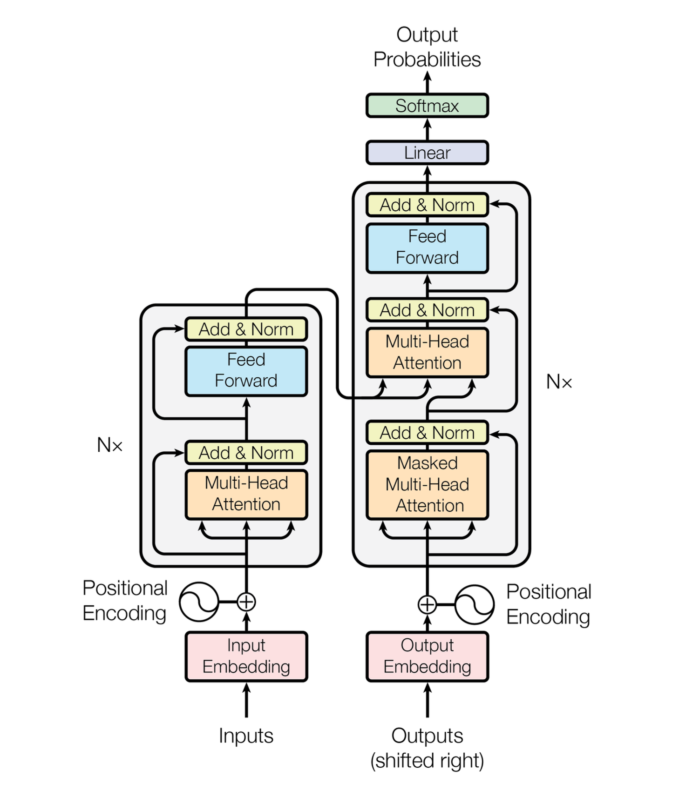

# Transformer Architecture: "Attention Is All You Need"

A PyTorch implementation of the Transformer architecture from the seminal paper "Attention Is All You Need" by Vaswani et al. This project provides a complete, modular implementation of the Transformer model built from scratch using PyTorch.



## Overview

This implementation faithfully recreates the Transformer architecture as described in the original paper, featuring:

- **Encoder-Decoder Architecture**: Six-layer encoder and decoder stacks
- **Multi-Head Self-Attention**: Scaled dot-product attention mechanism with multiple attention heads
- **Position-wise Feed-Forward Networks**: Two-layer fully connected networks with ReLU activation
- **Positional Encoding**: Sinusoidal position embeddings for sequence modeling
- **Residual Connections**: Skip connections around each sub-layer with layer normalization
- **Modular Design**: Clean, extensible codebase with separate modules for each component

## Architecture Components

### Core Modules

- **`transformer.py`**: Main Transformer model combining encoder and decoder
- **`multi_head_attention.py`**: Multi-head attention mechanism implementation
- **`encoder_block.py`** / **`decoder_block.py`**: Individual encoder and decoder layers
- **`feed_forward.py`**: Position-wise feed-forward networks
- **`positionalEnco.py`**: Sinusoidal positional encoding
- **`inputEmb.py`**: Input embeddings with scaling factor
- **`LayerNorm.py`**: Layer normalization implementation
- **`residual_connection.py`**: Residual connections with dropout
- **`projection_layer.py`**: Final output projection layer
- **`builder.py`**: Factory function for building complete models

### Key Features

#### Multi-Head Attention

The core attention mechanism implements scaled dot-product attention:

$$\text{Attention}(Q, K, V) = \text{softmax}\left(\frac{QK^T}{\sqrt{d_k}}\right)V$$

Where:
- $Q$ is the query matrix
- $K$ is the key matrix  
- $V$ is the value matrix
- $d_k$ is the dimension of the key vectors

Multi-head attention applies this mechanism multiple times in parallel:

$$\text{MultiHead}(Q, K, V) = \text{Concat}(\text{head}_1, ..., \text{head}_h)W^O$$

where each head is computed as:

$$\text{head}_i = \text{Attention}(QW_i^Q, KW_i^K, VW_i^V)$$

- Supports multiple attention heads for capturing different types of relationships
- Includes proper masking for causal attention in decoder

#### Positional Encoding

Since the model contains no recurrence or convolution, positional encodings are added to give the model information about the relative or absolute position of tokens in the sequence.

The positional encoding uses sine and cosine functions of different frequencies:

$$PE_{(pos,2i)} = \sin\left(\frac{pos}{10000^{2i/d_{model}}}\right)$$

$$PE_{(pos,2i+1)} = \cos\left(\frac{pos}{10000^{2i/d_{model}}}\right)$$

Where:
- $pos$ is the position in the sequence
- $i$ is the dimension index  
- $d_{model}$ is the model dimension

- Enables the model to understand sequence order without recurrence
- Allows the model to extrapolate to sequence lengths longer than those encountered during training

#### Layer Normalization

Layer normalization is applied after each sub-layer (Post-LN as per original paper):

$$\text{LayerNorm}(x) = \gamma \cdot \frac{x - \mu}{\sigma + \epsilon} + \beta$$

Where:
- $\mu$ is the mean: $\mu = \frac{1}{d}\sum_{i=1}^{d} x_i$
- $\sigma$ is the standard deviation: $\sigma = \sqrt{\frac{1}{d}\sum_{i=1}^{d}(x_i - \mu)^2}$
- $\gamma$ and $\beta$ are learnable scale and bias parameters
- $\epsilon$ is a small constant for numerical stability

The residual connection is then applied as:

$$\text{Output} = \text{LayerNorm}(x + \text{Sublayer}(x))$$

- Stabilizes training and improves convergence

## Installation

This project uses modern Python dependency management with `uv`. Ensure you have Python 3.12+ installed.

```bash
# Clone the repository
git clone https://github.com/JagjeevanAK/Attention-Is-All-You-Need.git
cd Attention-Is-All-You-Need

# Install dependencies
uv sync
```

### Dependencies

- **PyTorch**: Deep learning framework (>=2.8.0)
- **Python**: 3.12 or higher

## Usage

### Basic Usage

```python
from src.transformer.builder import build_transformer

# Build a transformer model
model = build_transformer(
    src_vocab_size=10000,    # Source vocabulary size
    tgt_vocab_size=10000,    # Target vocabulary size
    src_seq_len=512,         # Maximum source sequence length
    tgt_seq_len=512,         # Maximum target sequence length
    d_model=512,             # Model dimension
    N=6,                     # Number of encoder/decoder layers
    h=8,                     # Number of attention heads
    dropout=0.1,             # Dropout probability
    d_ff=2048               # Feed-forward dimension
)

# Example forward pass
src_tokens = torch.randint(0, 10000, (32, 128))  # (batch_size, seq_len)
tgt_tokens = torch.randint(0, 10000, (32, 64))   # (batch_size, seq_len)

# Create masks (implement according to your needs)
src_mask = torch.ones(32, 1, 1, 128)
tgt_mask = torch.tril(torch.ones(32, 1, 64, 64))

# Encode
encoder_output = model.encode(src_tokens, src_mask)

# Decode
decoder_output = model.decode(encoder_output, src_mask, tgt_tokens, tgt_mask)

# Project to vocabulary
output = model.project(decoder_output)
```

### Model Architecture

The model follows the exact specifications from the paper:

- **Model Dimension (d_model)**: 512
- **Number of Layers**: 6 for both encoder and decoder
- **Attention Heads**: 8
- **Feed-Forward Dimension**: 2048
- **Dropout**: 0.1

## Project Structure

```
src/transformer/
├── __init__.py
├── builder.py              # Model factory function
├── transformer.py          # Main Transformer class
├── encoder.py              # Encoder stack
├── decoder.py              # Decoder stack
├── encoder_block.py        # Single encoder layer
├── decoder_block.py        # Single decoder layer
├── multi_head_attention.py # Multi-head attention mechanism
├── feed_forward.py         # Position-wise feed-forward networks
├── positionalEnco.py       # Positional encoding
├── inputEmb.py            # Input embeddings
├── LayerNorm.py           # Layer normalization
├── residual_connection.py  # Residual connections
├── projection_layer.py     # Output projection
└── py.typed               # Type checking support
```

## Implementation Details

### Attention Mechanism
The implementation uses scaled dot-product attention with proper masking support:
- **Self-attention** in encoder layers
- **Masked self-attention** in decoder layers
- **Cross-attention** between encoder and decoder

### Training Considerations
- Uses Xavier uniform initialization for parameters
- Implements proper gradient scaling
- Supports custom learning rate scheduling (not included in base implementation)

### Performance
- Optimized for modern PyTorch versions
- Supports GPU acceleration
- Efficient memory usage with proper tensor operations

## Technical Specifications

| Component | Specification |
|-----------|---------------|
| Model Type | Encoder-Decoder Transformer |
| Attention Mechanism | Multi-Head Scaled Dot-Product |
| Normalization | Layer Normalization (Post-LN) |
| Activation | ReLU in feed-forward networks |
| Positional Encoding | Sinusoidal |
| Parameter Initialization | Xavier Uniform |

## Contributing

Contributions are welcome! Please feel free to submit a Pull Request. For major changes, please open an issue first to discuss what you would like to change.

## License

This project is open source and available under the [MIT License](LICENSE).

## References

- Vaswani, A., et al. (2017). "Attention Is All You Need." *Advances in Neural Information Processing Systems*, 30.
- [Original Paper](https://arxiv.org/abs/1706.03762)

---

*This implementation is for educational and research purposes, providing a clear understanding of the Transformer architecture as presented in the original paper.*